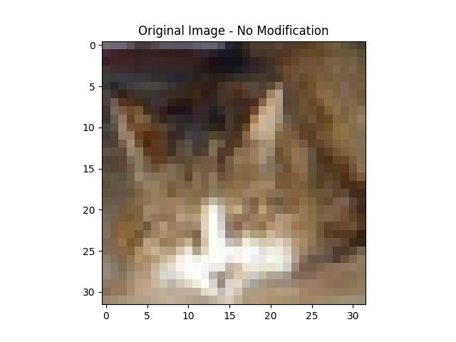
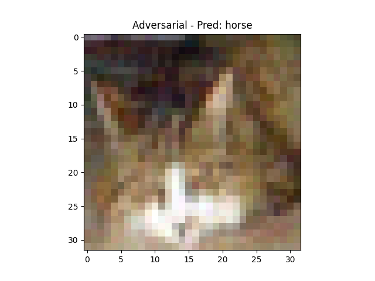
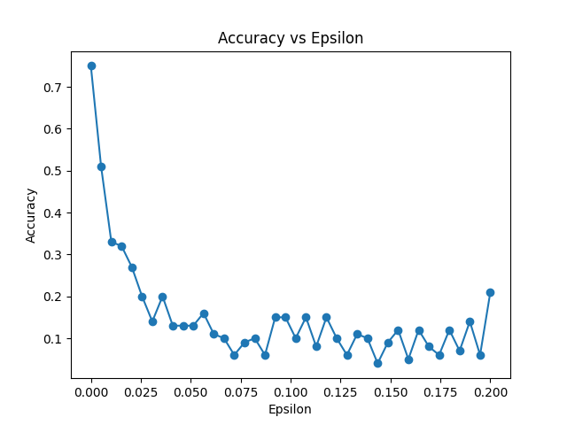

# 🔐 CIFAR-10 Adversarial Attack Using FGSM (Fast Gradient Sign Method)

Welcome to my learning project! 🙌 In this repository, I explore how machine learning models can be vulnerable to **adversarial attacks** and how these attacks can drastically affect model performance. Using the **CIFAR-10** dataset and the **Fast Gradient Sign Method (FGSM)**, I demonstrate how small, almost invisible changes to input data can confuse a well-trained image classifier. 

The goal here is to learn about the vulnerabilities in AI models and how adversarial attacks work, while also understanding how to evaluate and defend against these weaknesses.

---

## 📚 What is this project about?

This project is a **machine learning security exploration** where I trained a CNN (Convolutional Neural Network) on the **CIFAR-10** dataset. After training the model, I applied the **FGSM** attack to create **adversarial examples**. These are images that look almost identical to the originals but are subtly altered in a way that misleads the model into making incorrect predictions.

This project taught me:
- How **adversarial attacks** work in deep learning.
- How seemingly small changes in data can cause large shifts in model predictions.
- How to implement **FGSM** in Python using TensorFlow.
- How model accuracy decreases as adversarial noise (epsilon) increases.

---

## 🛠️ How does it work?

### The Workflow:
1. **Train the Model**: I trained a CNN on the **CIFAR-10** dataset using standard image classification techniques and applied **data augmentation** to improve generalization.
2. **FGSM Attack**: After training the model, I used **FGSM** to generate adversarial images. The attack works by adding a small perturbation (controlled by a parameter called **epsilon**) to the image in the direction that maximizes the model’s prediction error.
3. **Testing and Evaluation**: I tested the model with increasing levels of epsilon to see how accuracy dropped as the adversarial perturbation increased.

### Files in the project:
- **`train.py`**: This script trains the CNN model on the CIFAR-10 dataset using data augmentation to improve model robustness.
- **`model.py`**: Defines the CNN architecture used for training and evaluation.
- **`attack.py`**: Contains the implementation of the FGSM attack to create adversarial examples.
- **`tests.py`**: Runs multiple tests on the model with different epsilon values, creating adversarial images and evaluating the model's accuracy.

---

## 🚀 How to Run the Project

1. **Clone the repository**:
    ```bash
    git clone https://github.com/your-username/adversarial-attack-cifar10.git
    cd adversarial-attack-cifar10
    ```

2. **Install dependencies**:
    Install the necessary Python packages by running:
    ```bash
    pip install -r requirements.txt
    ```

3. **Train the Model**:
    To train the CNN on CIFAR-10, use:
    ```bash
    python train.py
    ```

4. **Run the FGSM Attack**:
    After training, use `attack.py` to generate adversarial images and see how the model gets confused:
    ```bash
    python attack.py
    ```

5. **Evaluate the Model on Adversarial Images**:
    Use `tests.py` to run a series of tests on adversarial images with varying epsilon values:
    ```bash
    python tests.py
    ```

---

## 🔍 Understanding the Results

### 1. Accuracy vs Epsilon

The **epsilon** parameter in FGSM controls the intensity of the perturbation added to the input images. A higher epsilon means more noticeable changes, which makes it easier to fool the model. Below is the graph showing how the model’s accuracy declines as epsilon increases:


As we can see, when epsilon is **0** (no perturbation), the model performs well, but as we increase epsilon, the accuracy drops significantly. Even small perturbations (like epsilon = 0.01) can cause a major accuracy drop, showing how vulnerable machine learning models are to adversarial attacks.

### 2. Visual Examples: Original vs Adversarial

Here’s an example of how a small perturbation can change the model's prediction completely:

- **Original Image (Prediction: Cat)**

  

- **Adversarial Image (Prediction: Horse)**

  

Though the images look nearly identical to a human observer, the model is fooled into making an incorrect prediction. This showcases the power of adversarial attacks and highlights how subtle changes can lead to drastically different outputs.

---

## 🧠 What did I learn from this?

### Key Takeaways:
- **Machine learning models can be easily fooled** by adversarial examples, which poses significant challenges in deploying AI systems in the real world (like in self-driving cars or facial recognition).
- **FGSM is a fast and efficient method** for creating adversarial examples. It uses gradients to determine which pixels to modify in a way that confuses the model.
- **Epsilon is critical**: Even small changes in epsilon can drastically change the model’s performance. This shows how sensitive neural networks are to small perturbations in the input.



### How is this useful?
Understanding adversarial attacks is crucial in the field of **AI security**. As machine learning models are increasingly used in critical systems (healthcare, security, autonomous driving), being aware of these vulnerabilities allows developers and researchers to design **more robust and secure AI systems**. 

By simulating these attacks, I learned not only how they work but also how we might defend against them in future projects.

---

## 🎯 What’s next?

This is just the beginning of my exploration into adversarial machine learning and model robustness. My next steps will be:
- Exploring **defensive techniques** like adversarial training to make models more robust against attacks.
- Experimenting with different adversarial attack methods, such as **Projected Gradient Descent (PGD)**.
- Investigating real-world applications of adversarial attacks and how they impact AI security.

---

## 🤗 A humble note

I’m still learning and growing as a machine learning developer. If you have any suggestions or feedback, I would love to hear them! Feel free to open an issue or reach out if you have ideas for improving this project. 

Thank you so much for taking the time to explore this project! 🙏

---

### Let’s connect!
[LinkedIn](https://www.linkedin.com/in/jos%C3%A9-eduardo-santos-rabelo-296239234/)
